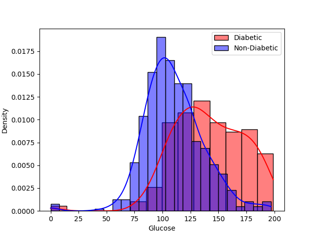
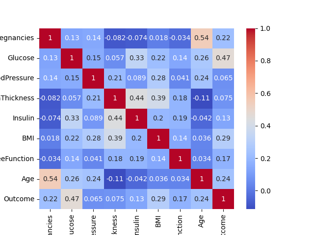
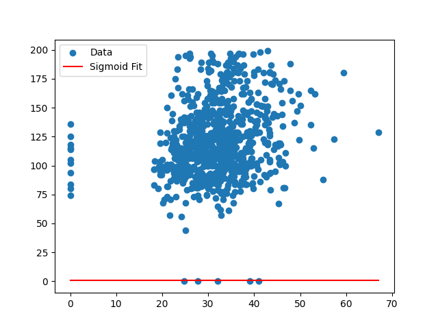
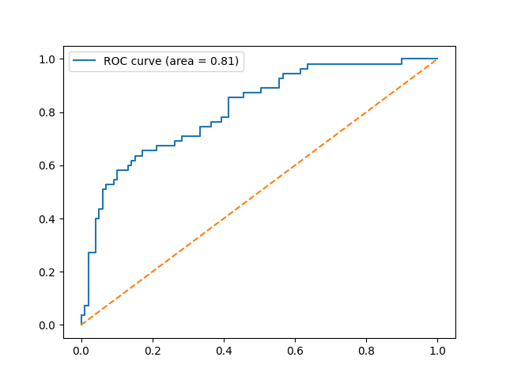

# Diabetes Risk Analysis and Prediction

This project analyzes the Pima Indians Diabetes dataset to uncover statistical insights and build a logistic regression model for predicting diabetes risk. Various visualizations and statistical analyses were performed to explore relationships between health factors and diabetes outcomes.

## Dataset
- **Source:** [Pima Indians Diabetes Database](https://www.kaggle.com/datasets/uciml/pima-indians-diabetes-database)
- **Description:** This dataset contains health-related variables (e.g., glucose levels, BMI, and age) for Pima Indian women aged 21 and above. It also includes an `Outcome` column indicating diabetes status (1 = diabetic, 0 = non-diabetic).

---

## Key Objectives
1. Analyze the distribution of key health features.
2. Perform statistical tests to identify significant differences in features between diabetic and non-diabetic individuals.
3. Fit a sigmoid function to predict glucose levels based on BMI.
4. Build and evaluate a logistic regression model to predict diabetes risk.

---

## Results

### 1. Glucose Distribution
The distribution of glucose levels for diabetic and non-diabetic individuals:


### 2. Correlation Heatmap
Correlation between all features:


### 3. Sigmoid Fit
Sigmoid function fit predicting glucose levels based on BMI:


### 4. ROC Curve
Receiver Operating Characteristic (ROC) curve for the logistic regression model:


---

## Statistical Test Results
- **Glucose Levels:** T-statistic = `TBA`, P-value = `TBA`
- **BMI Levels:** T-statistic = `TBA`, P-value = `TBA`

---

## Logistic Regression Model Performance
- **Accuracy:** `TBA`
- **Precision:** `TBA`
- **Recall:** `TBA`
- **ROC AUC:** `TBA`

---

## How to Run the Code
1. Install the required Python packages:
   ```bash
   pip install pandas numpy matplotlib seaborn scipy scikit-learn
   ```
2. Run the Python script in the terminal or your preferred IDE.
3. Output images will be saved in the `images` folder.
